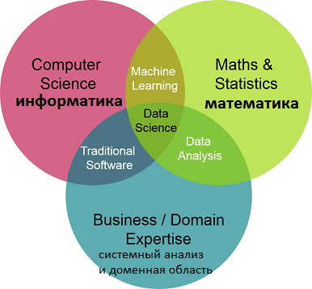
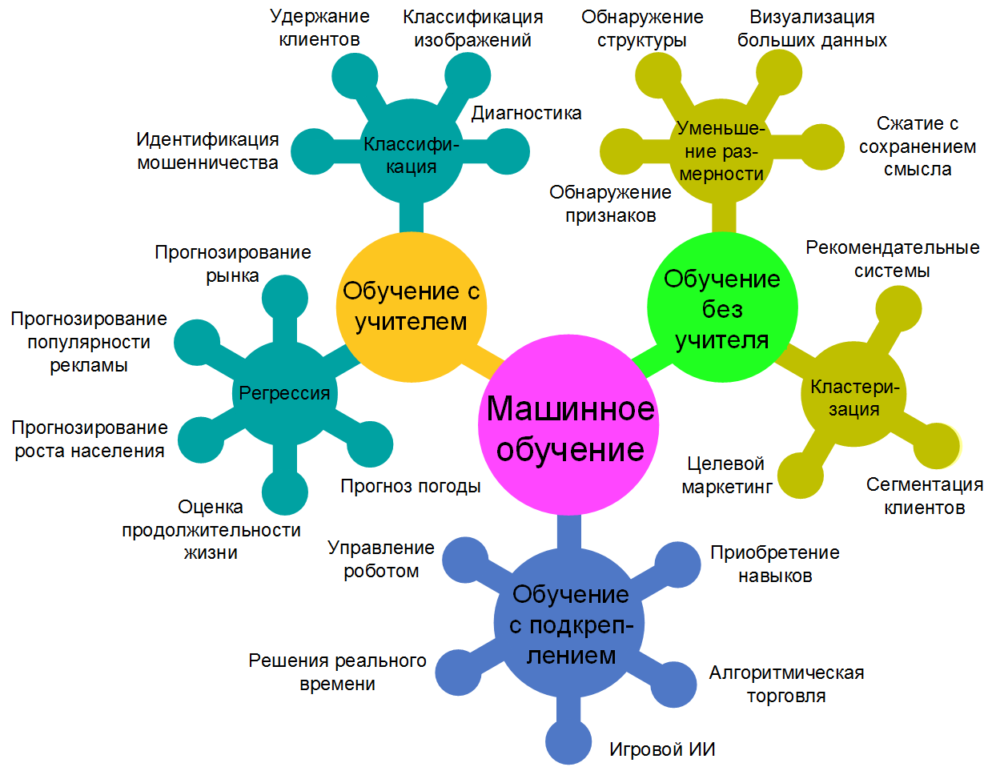

## Определение DS

Computer science/IT
* Дает инструменты для ds.
Domains/Business Knowledge
* Хотим сократить отток пользователей - бизнес термины, но в термины
  DS нужно перевести.
  автор: половина проектов рассыпается, т.к. не поставлены задачи.
  ваши модели могли улучшать метрики бизнеса
Math and Statistics
  
Доменные знания изучают на работе, на курсе очень сложно изучить.

## В перспективе можно стать

* Data scientist (математик-программист, исследователь данных) - мы
  готовим этих. Автоматизация бизнес процессов, кредитный скоринг,
  например. готовит модель - прототип
* Data analyst (аналитик данных) на стыке людей из бизнеса и тех.
  команды. Онлайн магазин, кастомизация под клиента. Выявляя
  параметры клиента, и характеристики товара с маржинальностью
  выводится товары.
* Data engineer (специалист по обработке данных) готовит данные,
  проводит их очистку. Они выполняют необходимую черновую работы.
* machine learning engineer - опромышливаниет модель - прототип.
* deep learing eng - пока этим не будем заниматься.

Искать вакансии по словам Data scientist,
потом можно искать по технологиям. sky-learn

два профиля:
* понимают как помочь бизнесу, добиться целей бизнеса. Для этого
  использовать инструментарий. Они построят 100 моделей и заработают
  больше денег, чем 10 хардовый моделей.
* хардовые - строют модели, там уже можно изучать математику.

Под big data - понимается стек технологий для обработки данных,
которые обрабатываются распределённое.

## Цель курса

* Этот курс вводный, вы не станете готовым специалистом. Дать
  понимание проектов.
* Познакомиться с основными библиотеками.
* Возьмем проект, разобьем его на стадии
* на самостоятельном проекте отточим новые зания.

После этого курса углубляйте свои знания!!
Автор: мое вэлью от ответов на ваши вопросы, т.к. вы можете
все прочитать

К навыкам:
* питон
* школьная математика

Изучим:
Навыки - классич проект, разобьем его на 6 стадий и пройдемся по
некоторым стадиям. Одну и ту же задачу мы можем решать с разной
целью.
Инструментарий

Как устроен учебный процесс
задаем вопросы на вебинарах, с чем не разобрались на видеоуроке или
домашней работы.
После визуализации решаем курсовой проект.
На курсовом проекте оттачиваем мысли на вебинаре.

Сдавайте домашки в анаконде, а не в py-файлах.

Дана выборка для разработки, и выборка по результату. Нужно
выполнить требования по качеству модели.

## Домашние задания

Доступны после видео урока.
* jupiter
* Прекрепляем ссылку на гит.
* сдавайте в срок
* автор: рекомендует выполнять задания со звездочкой.
* 

Есть инструкция по анаконде.

## вебинары

возьмем задачу, возмьмем постановку. У нас будет одна задача, стадии
которой мы пройдем по всему курсу.
Таблица лидеров курсовых проектов. 

## Если возникнут сложности

Пересмотрите видеоурок еще раз, если что-то не поняли.
Если по домашке не поняли ищите в инете, затем у одногруппников,
или в лектора или у наставника.

## Ответы на вопросы.

автор: ошибки из-за невнимательности приводят к падению точности курсового проекта.
Потому что человек неправильно предоставил формат прогнозов.

## Какие виды задач в маш. обучении.

Обучение с учителем.

Есть объект, например квартира. У квартиры есть ее характеристики
площать, год постройки
Мы знаем когда она была продана.

Задача модели спрогнозировать цену.

## Задачи машинного обучения

Процесс решения задачи в машинном обучении взят из статьи  
[Введение в машинное обучение и искусственные нейронные сети](https://foobar167.github.io/page/vvedeniye-v-mashinnoye-obucheniye-i-iskusstvennyye-neyronnyye-seti.html):
и представлен на картинке:

Регрессия - скаляр от -8 до +8
Классификация - бинарная или множественная
Уменьшение размерности - из н-мерности убираем незначащие параметры
Кластеризация - из всего многообразия выделяем сущности по признаку.

## Процесс решения задачи

6 шагов решения задачи показаны на рисунке:

На курсе мы в основном будем заниматься:
* Data Preparation
* Modeling
* Evaluation - кач-во работы модели (на истор. данных, аб тест на проде)

* Data presentation - внедрение. Просто жива модель на сервера, и
  как качественно работает модель.

## Книги

Разберетесь с этими книгами и все у вас будет в порядке:
1. Hands-On Machine Learning with Scikit-Learn and TensorFlow pdf
2. сара гвидо -> introduction to machine learning with python pdf
3. машинное обучение без лишних слов Ее можно читать на русском в
оригинале, поскольку автор русский. 
4. Python и машинное обучение. Машинное и глубокое обучение с
использованием Python, scikit-learn и TensorFlow | Рашка Себастьян,
Мирджалили Вахид
5. Уэс Маккини: Python и анализ данных - может немного старая
6. статистика для всех сара бослаф pdf -- на дальние горизонты
